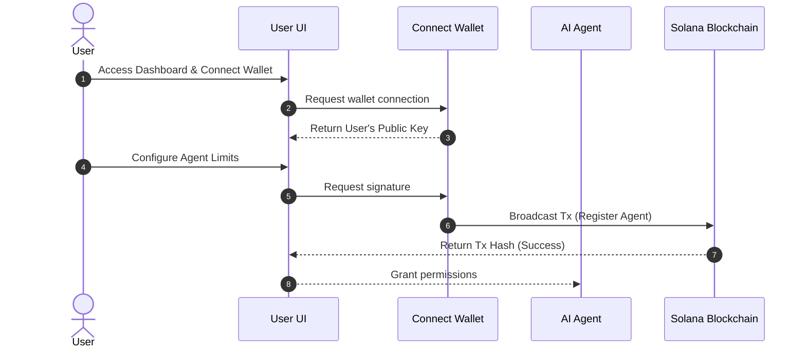
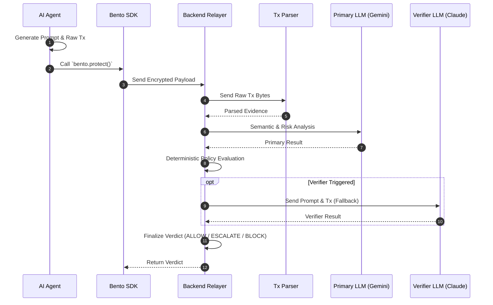
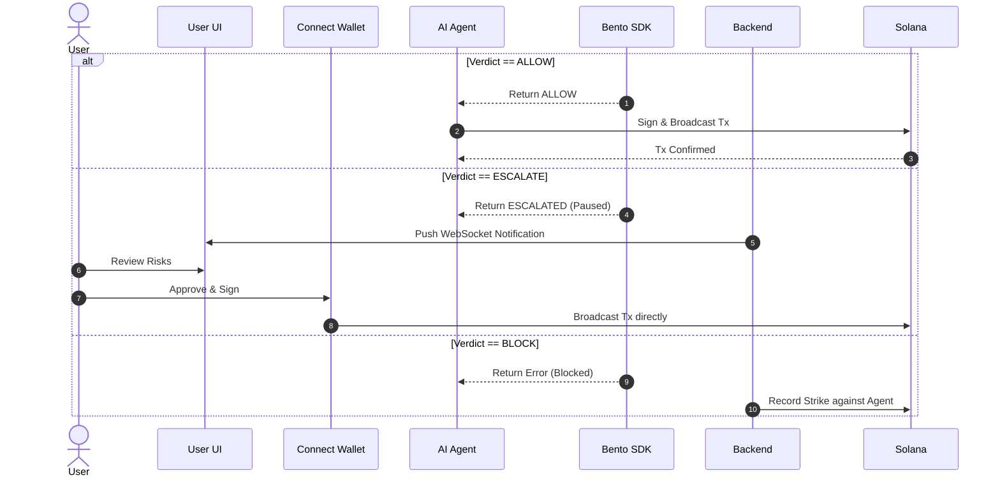

# Architecture

Bento Guard SDK provides a secure layer for Autonomous AI Agents operating on the Solana blockchain. Below is the detailed workflow of how Bento Guard secures autonomous agent transactions, broken down into 3 phases.

## Phase 1: Registration & Initialization

## Phase 2: AI Protect Flow & Cross-Analysis

## Phase 3: Settlement

## Key Components

1. **AI Agent**: The autonomous entity making decisions based on user input or internal logic.
2. **Bento Guard SDK**: The core security middleware. It enforces policies (e.g., spending limits, authorized actions) and ensures that the agent cannot perform malicious or unauthorized operations.
3. **Solana Blockchain**: The decentralized network where the final transactions are executed and recorded immutably.
