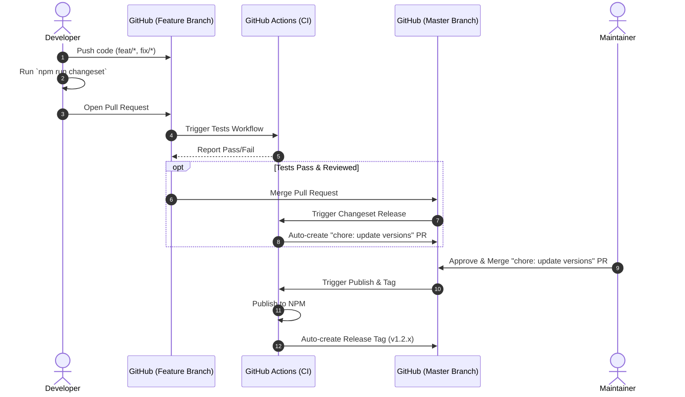

# Workflows

This document defines the standard workflow, branching strategy, and necessary checklists to ensure stability and security for the Bento Guard SDK project.

## 1. Branching Strategy

The project uses a simplified Git Flow model integrated with Changesets for automated releases.

### Main Branches
- **`master`**: The primary branch of the project. Code on this branch must always be stable and ready for release. Automated CI/CD actions (Release, Deploy Docs) are bound to this branch.
- **`develop`**: The integration branch for new features that are not yet ready for `master`. This branch also runs automated Tests and Format Checks to ensure code integrity before merging into `master`.

### Supporting Branches
- **`feat/*`** (e.g., `feat/add-solana-auth`): Used for developing new features. Branched from `master` or `develop`.
- **`fix/*`** (e.g., `fix/bug-0806`): Used for bug fixes.
- **`chore/*`** (e.g., `chore/update-dependencies`): Used for maintenance tasks that do not affect code logic (updating libraries, modifying docs, etc.).

---

## 2. Standard Workflow

1. **Create a new branch**: Developers create a new branch (`feat/...`, `fix/...`) from `master` or `develop`.
2. **Code & Test**: Implement the changes. Run `npm run test` to ensure existing features are not broken.
3. **Create a Changeset**: Once the feature is complete, run the `npm run changeset` command. Answer the prompts (Major, Minor, or Patch) and describe the changes. A markdown file will be automatically generated in the `.changeset` directory.
4. **Commit**: Execute `git commit` (Husky will automatically trigger `lint-staged` and `tsc` to check for syntax/formatting errors).
5. **Pull Request (PR)**: Push the branch to GitHub and open a PR against the base branch (`master` or `develop`). GitHub Actions will automatically run the `Tests` workflow for validation.
6. **Code Review & Merge**: After passing CI and receiving approval, merge the PR.
7. **Automated Release**:
   - When a PR containing a changeset file is merged into `master`, a GitHub Action will bundle them and automatically open a new PR named **"chore: update versions"**.
   - When the maintainer is ready to publish a new version, they simply merge this "chore: update versions" PR. The system will automatically publish the package to NPM, generate the Changelog, and create a GitHub Release Tag (`vX.X.X`).

### Workflow Sequence Diagram

---

## 3. Developer Checklist

Before opening a Pull Request, ensure you have completed the following:

- [ ] The feature/bug fix is complete and the code logic works as intended.
- [ ] Added or updated Unit Tests (if necessary) and verified that `npm run test` returns **PASS**.
- [ ] Ran `npm run lint` and `npm run format` (or ensured Husky does not complain during the commit).
- [ ] If the changes affect public features, updated the relevant Documentation.
- [ ] **Ran `npm run changeset`** to generate a changelog entry (unless the change is trivial and does not require a version bump).
- [ ] Filled out all required information in the GitHub PR Template.

---

## 4. Security & CI/CD
- **Dependency Pinning**: All GitHub Actions in the project are pinned to specific SHA hashes (instead of version tags like `@v4`) to maximize security against Supply Chain Attacks.
- **Automated Vulnerability Scanning**: `codeql-analysis.yml` and `socket-scan.yml` will continuously scan for security vulnerabilities.
- **Telegram Notifications**: If a Build or Test process fails on the main branch, a notification will be immediately dispatched to Telegram.
